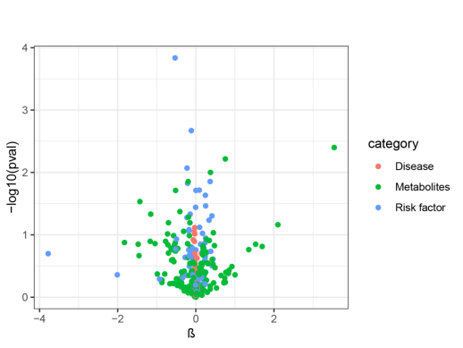

# Summary

Effect of 295 traits on AD in the database.

The x-axis shows the standard deviation \(SD\) change or log odds ratio \(OR\) for AD per SD decrease in each of 295 traits. The y-axis shows the p-value for the association on a -log10 scale. The effects on the x-axis correspond to the slope from fixed effects inverse variance weighted \(IVW\) linear regression of 295 traits effects regressed on the SNP-exposure effects. When -log10 \(pval\)&gt; 1.30, the p-value is &lt;0.05.

